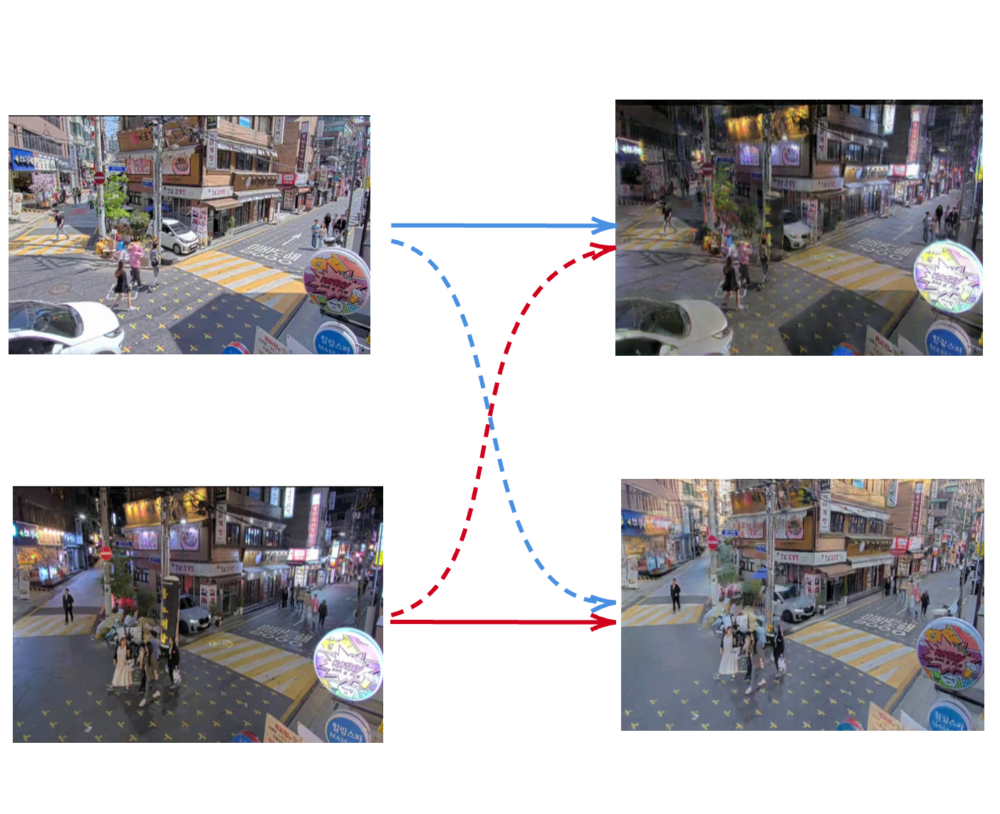

# Generating Realistic Traffic Scenarios: A Deep Learning Approach Using Generative Adversarial Networks (GANs)

## Overview
Diverse and realistic traffic scenarios are crucial for testing systems and human behaviour in transportation research. Leveraging Generative Adversarial Networks (GANs), this study focuses on video-to-video translation to generate a variety of traffic scenes. By employing GANs for video-to-video translation, the study accurately captures the nuances of urban driving environments, enriching realism and breadth. One advantage of this approach is the ability to model how road users adapt and behave differently across varying conditions depicted in the translated videos. For instance, certain scenarios may exhibit more cautious driver behaviour, while others may involve heavier traffic and faster speeds. Maintaining consistent driving patterns in the translated videos improves their resemblance to real-world scenarios, thereby increasing the reliability of the data for testing and validation purposes. Ultimately, this approach provides researchers and practitioners with a valuable method for evaluating algorithms and systems under challenging conditions, advancing transportation models and automated driving technologies.



## Usage of the code
The code is open-source and free to use. It is aimed for, but not limited to, academic research. We welcome forking of this repository, pull requests, and any contributions in the spirit of open science and open-source code 😍😄 For inquiries about collaboration, you may contact Md Shadab Alam (md_shadab_alam@outlook.com) or Pavlo Bazilinskyy (pavlo.bazilinskyy@gmail.com).

## Getting Started
Tested with Python 3.9.1. To setup the environment run these two commands in a parent folder of the downloaded repository (replace `/` with `\` and possibly add `--user` if on Windows:

**Step 1:**  

Clone the repository
```command line
git clone https://github.com/Shaadalam9/gans-traffic.git
```

**Step 2:** 

Install Dependencies
```command line
pip install -r requirements.txt
```

# Usage

**Data Preparation**

Traffic data is available at [OneDrive Link](https://tuenl-my.sharepoint.com/personal/p_bazilinskyy_tue_nl/_layouts/15/onedrive.aspx?FolderCTID=0x0120003C1F03DD1FAC5542937CFDF71E074F8E&id=%2Fpersonal%2Fp%5Fbazilinskyy%5Ftue%5Fnl%2FDocuments%2FProjects%2FTUe%20GANS).

Organize the videos in such a way that it contains train/val set and source domain A/ target domain B hierarchically.
```
|-- video
|   |-- test
|   `-- train
```
**Command to run Experiment**
```command line
python main.py
```

**Acknowledgment**

Code borrowed from [Unsup-Recycle-GAN](https://github.com/wangkaihong/Unsup_Recycle_GAN), and [ReReVST](https://github.com/daooshee/ReReVST-Code/).
