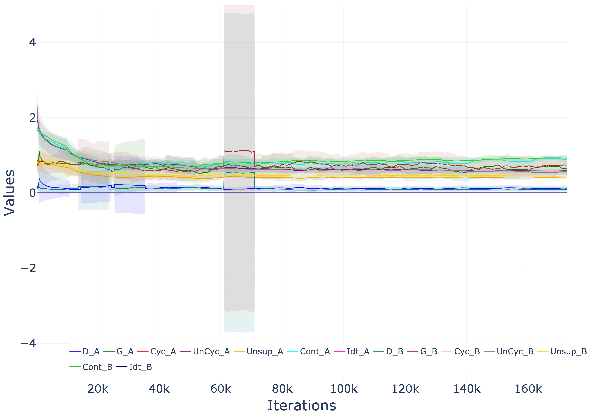

# Generating Realistic Traffic Scenarios: A Deep Learning Approach Using Generative Adversarial Networks (GANs)

## Overview
Traffic simulations are crucial for testing systems and human behaviour in transportation research. This study investigates the potential efficacy of Unsupervised Recycle Generative Adversarial Networks (Recycle–GANs) in generating realistic traffic videos by transforming daytime scenes into nighttime environments and vice-versa. By leveraging Unsupervised Recycle-GANs, we bridge the gap between data availability during day and night traffic scenarios, enhancing the robustness and applicability of deep learning algorithms for real-world applications. GPT-4V was provided with two sets of six different frames from each day and night time from the generated videos and queried whether the scenes were artificially created based on lightning, shadow behaviour, perspective, scale, texture, detail and presence of edge artefacts. The analysis of GPT-4V output did not reveal evidence of artificial manipulation, which supports the credibility and authenticity of the generated scenes. Furthermore, the generated transition videos were evaluated by 15 participants who rated their realism on a scale of 1 to 10, achieving a mean score of 7.21. Two persons identified the videos as deep-fake generated without pointing out what was fake in the video; they did mention that the traffic was generated.

## Usage of the code
The code is open-source and free to use. It is aimed for, but not limited to, academic research. We welcome forking of this repository, pull requests, and any contributions in the spirit of open science and open-source code 😍😄 For inquiries about collaboration, you may contact Md Shadab Alam (md_shadab_alam@outlook.com) or Pavlo Bazilinskyy (pavlo.bazilinskyy@gmail.com).

## Citation
If you use the gans-traffic for academic work please cite the following paper:

> Alam, M. S., Martens, M., & Bazilinskyy, P. (2025). Generating Realistic Traffic Scenarios: A Deep Learning Approach Using Generative Adversarial Networks (GANs). Human Interaction and Emerging Technologies (IHIET-AI 2025): Artificial Intelligence and Future Applications, 3(3). http://doi.org/10.54941/ahfe1005927

## Getting Started
Tested with Python 3.9.21. To setup the environment run these two commands in a parent folder of the downloaded repository (replace `/` with `\` and possibly add `--user` if on Windows:

**Step 1:**  

Clone the repository
```command line
git clone https://github.com/Shaadalam9/gans-traffic.git
```

**Step 2:**

Create a new virtual environment
```command line
python -m venv venv
```

**Step 3:**

Activate the virtual environment
```command line
source venv/bin/activate
```

On Windows use
```command line
venv\Scripts\activate
```

**Step 4:**

Install dependencies
```command line
pip install -r requirements.txt
```

**Step 5:**

Download the supplementary material from [4TU Research Data](https://doi.org/10.4121/80c664cb-a4b5-4eb1-bc1c-666349b1b927) and save them in the current folder.

**Step 6:**

Run the main.py script
```command line
python3 main.py
```

# Usage

**Data Preparation**

Organize the videos in such a way that it contains train/val set and source domain A/ target domain B hierarchically.
```
|-- video
|   |-- test
|   `-- train
```

##
Configuration of the project needs to be defined in `gans-traffic/config`. Please use the `default.config file` for the required structure of the file. If no custom config file is provided, `default.config` is used. The config file has the following parameters:
- **`checkpoints`**: Specifies the location of the video files.
- **`plotly_template`**: Template used to style graphs in the analysis (e.g., `plotly_white`, `plotly_dark`).


## Training Configuration

Below are the variables and their values used for the training process:

| Parameter               | Value               | Description                                                                            |
|-------------------------|---------------------|----------------------------------------------------------------------------------------|
| `model`               | `unsup_single`     | Specifies the model type used in training.                                            |
| `dataset_mode`        | `unaligned_scale`  | Indicates the dataset mode used.                                                      |
| `name`                | `v2c_experiment`  | Name of the experiment, used for saving models and logs.                              |
| `loadSizeW`           | `542`              | Input image width after resizing.                                                     |
| `loadSizeH`           | `286`              | Input image height after resizing.                                                    |
| `resize_mode`         | `rectangle`        | Mode used for resizing input images.                                                  |
| `fineSizeW`           | `512`              | Final width of the cropped/resized image.                                             |
| `fineSizeH`           | `256`              | Final height of the cropped/resized image.                                            |
| `crop_mode`           | `rectangle`        | Crop mode for images.                                                                 |
| `which_model_netG`    | `resnet_6blocks`   | Generator architecture used in the model.                                             |
| `no_dropout`          | -                  | Disables dropout in the model.                                                        |
| `pool_size`           | `0`                | Sets the image buffer size for discriminator updates.                                  |
| `lambda_spa_unsup_A`  | `10`               | Weight for unsupervised spatial loss in domain A.                                      |
| `lambda_spa_unsup_B`  | `10`               | Weight for unsupervised spatial loss in domain B.                                      |
| `lambda_unsup_cycle_A`| `10`               | Weight for unsupervised recycle loss in domain A.                                      |
| `lambda_unsup_cycle_B`| `10`               | Weight for unsupervised recycle loss in domain B.                                      |
| `lambda_cycle_A`      | `0`                | Weight for supervised cycle loss in domain A (not used in this configuration).         |
| `lambda_cycle_B`      | `0`                | Weight for supervised cycle loss in domain B (not used in this configuration).         |
| `lambda_content_A`    | `1`                | Weight for content loss in domain A.                                                  |
| `lambda_content_B`    | `1`                | Weight for content loss in domain B.                                                  |
| `batchSize`           | `1`                | Batch size used for training.                                                         |
| `noise_level`         | `0.001`            | Noise level added to inputs for regularization.                                       |
| `niter_decay`         | `0`                | Number of epochs for linear learning rate decay.                                       |
| `niter`               | `1`                | Number of epochs at the initial learning rate.                                         |

## Day-to-Night Translation Example

Below is an example image showcasing the translation of traffic scenes from day to night in Gangnam Street, Korea. This demonstrates the model's ability to learn temporal and semantic consistency in unpaired video-to-video translation tasks.


## Loss curve


[](https://htmlpreview.github.io/?https://github.com/Shaadalam9/gans-traffic/blob/main/ReadmeFiles/plot.html)
- **D_A**: Discriminator loss for domain A.
- **G_A**: Generator loss for domain A.
- **Cyc_A**: Cycle consistency loss for domain A, ensuring that an image translated to domain B and back results in the original image.
- **UnCyc_A**: Unsupervised cycle loss for domain A, promoting temporal consistency.
- **Unsup_A**: Unsupervised loss for domain A, enforcing spatial consistency using synthetic optical flow.
- **Cont_A**: Content loss for domain A, preserving semantic content during translation.
- **Idt_A**: Identity loss for domain A, ensuring that images already in domain A remain unchanged.
- **D_B**: Discriminator loss for domain B.
- **G_B**: Generator loss for domain B.
- **Cyc_B**: Cycle consistency loss for domain B.
- **UnCyc_B**: Unsupervised cycle loss for domain B.
- **Unsup_B**: Unsupervised loss for domain B.
- **Cont_B**: Content loss for domain B.
- **Idt_B**: Identity loss for domain B.

### Notes:
- This code requires a CUDA enabled GPU.
- The experiment is named `v2c_experiment`, and all logs and checkpoints will be stored under this name.
- The model uses a `resnet_6blocks` generator architecture with no dropout applied.
- The configuration uses unsupervised spatial and cycle consistency losses, with supervised cycle losses disabled.
- Input images are resized to `542x286` and further cropped to `512x256` for training.


## License
This project is licensed under the MIT License - see the LICENSE file for details.

**Acknowledgment**

The code for this repository is inspired from
Wang, K., Akash, K., & Misu, T. (2022, June). Learning temporally and semantically consistent unpaired video-to-video translation through pseudo-supervision from synthetic optical flow. In Proceedings of the AAAI Conference on Artificial Intelligence (Vol. 36, No. 3, pp. 2477-2486).  DOI: [10.1609/aaai.v36i3.20148](https://doi.org/10.1609/aaai.v36i3.20148)
